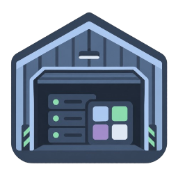

<div align="center">
  

  <h1>Hangar</h1>

  <p><strong>Opinionated homelab management.</strong><br />
  Your Docker Compose stacks live in a git repository. Hangar installs them, runs them, keeps them up to date and puts them on one dashboard.</p>

  <p>
    <a href="https://github.com/4thlabs/hangar/actions/workflows/ci.yml"></a>
    <a href="https://github.com/4thlabs/hangar/pkgs/container/hangar"></a>
    <a href="package.json"></a>
    
    
    
    
  </p>

  <p>
    <a href="docs/getting-started.md">Getting started</a> ·
    <a href="docs/store.md">The store</a> ·
    <a href="docs/widgets.md">Widgets</a> ·
    <a href="docs/cli.md">CLI</a> ·
    <a href="docs/development.md">Development</a>
  </p>
</div>

<!-- Screenshot of the dashboard goes here:  -->

## Why Hangar

A homelab tends to end up as a folder of `compose.yml` files, a `.env` full of secrets, and a
handful of shell aliases to bring things up in the right order. Hangar keeps that model — plain
Compose files in a git repository you own — and adds what is tedious to do by hand:

- **A store you own.** Every app is a folder with a `compose.yml` in your own git repository.
  Hangar clones it, links the apps you install, and runs `docker compose` against them.
- **Apps at a glance.** Status, containers, live logs and stats for every installed stack, with
  up, update, force recreate and down one click away and their output streamed as they run.
- **Image updates.** Every four hours Hangar asks the registries whether a newer image exists
  for what you run, and every night it can pull and recreate the outdated apps for you.
- **One global environment.** Hangar scans the installed stacks for the `${VARIABLES}` they
  reference and lists the ones still to fill in `.env.global`, which you edit from the UI.
- **A dashboard.** Widgets for Docker, Arcane, Backrest, Beszel, Frigate, Gluetun, Jellyfin,
  Miniflux and GitHub releases, laid out from the store's `hangar.yml`.
- **Notifications.** Available updates and the result of the nightly auto-update land in the
  notification menu.
- **Edit in place.** The `compose.yml` of each app and the store's `hangar.yml` can be edited
  from the browser, validated before they are written.

> [!NOTE]
> The web interface is in French.

## Quick start

Hangar runs as a single container that talks to the host's Docker daemon.

```yaml
# compose.yml
services:
  hangar:
    image: ghcr.io/4thlabs/hangar:latest
    container_name: hangar
    environment:
      - DOMAIN=${DOMAIN?required}
      - HANGAR_DATA_DIR=${PWD}/.data
      - HANGAR_STORE_URL=${HANGAR_STORE_URL?required}
      - BETTER_AUTH_URL=${BETTER_AUTH_URL?required}
      - BETTER_AUTH_SECRET=${BETTER_AUTH_SECRET?required}
    volumes:
      - ${PWD}/.data:/app/data
      - ${PWD}/.data:${PWD}/.data
      - /var/run/docker.sock:/var/run/docker.sock
    ports:
      - 3010:3010
```

Create a `.env` next to it:

```dotenv
DOMAIN=example.com
HANGAR_STORE_URL=https://github.com/you/your-hangar-store.git
BETTER_AUTH_URL=https://hangar.example.com
BETTER_AUTH_SECRET=   # openssl rand -base64 32
```

Then start it:

```bash
docker compose up -d
```

Open `http://<host>:3010`, create your account, then go to **Paramètres → Store** to clone your
store. The full walkthrough, including the layout of the data directory and the reverse proxy,
is in [Getting started](docs/getting-started.md).

## Documentation

| Guide                                      | What it covers                                                       |
| ------------------------------------------ | -------------------------------------------------------------------- |
| [Getting started](docs/getting-started.md) | Running the container, environment variables, first launch, updates  |
| [The store](docs/store.md)                 | Repository layout, `compose.yml` conventions, `hangar.yml` reference |
| [Widgets](docs/widgets.md)                 | Every dashboard widget, its options and the API key it reads         |
| [CLI](docs/cli.md)                         | Driving the store from a terminal                                    |
| [Development](docs/development.md)         | Running from source, scripts, database, tests and architecture       |

## Built with

[Waku](https://waku.gg) (React Server Components) · [Hono](https://hono.dev) ·
[Drizzle ORM](https://orm.drizzle.team) on SQLite · [Better Auth](https://better-auth.com) ·
[Sidequest](https://github.com/sidequestjs/sidequest) for scheduled jobs · [dockerode](https://github.com/apocas/dockerode) ·
[Tailwind CSS](https://tailwindcss.com) and [shadcn/ui](https://ui.shadcn.com).
App icons come from [selfh.st/icons](https://selfh.st/icons), widget icons from
[Dashboard Icons](https://dashboardicons.com), and the clock's from [Fluent Emoji](https://github.com/microsoft/fluentui-emoji).
